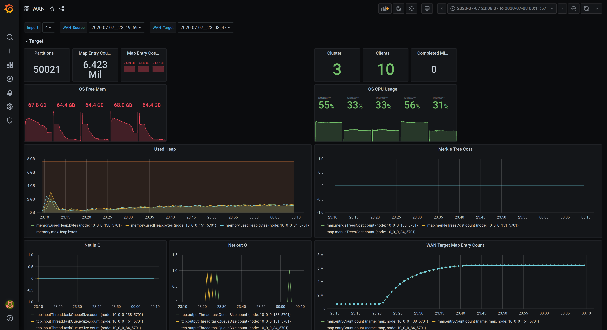
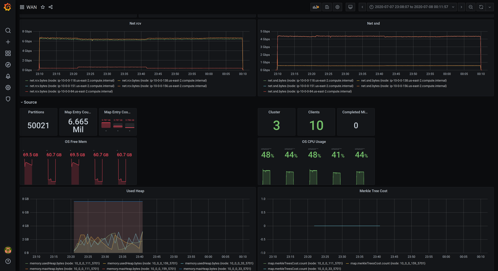
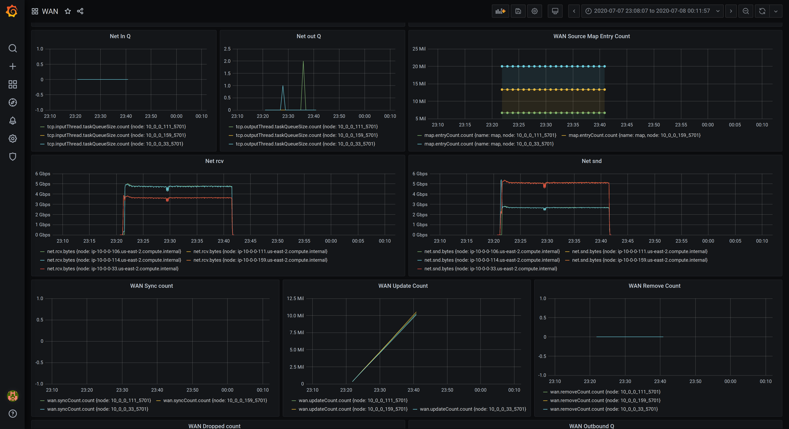

# Hazelcast Diag viewer

Scripts that visualize diagnostics output on Grafana using Influx DB backend.
The scripts can also parse Dstat CSV files as produced by a simulator run.

# Requirements

## Influx DB

Run `docker run -p 8086:8086 -v $PWD:/var/lib/influxdb influxdb` to start an instance inside a docker container.
The default port is exposed in the host OS, and the data directory is persisted in the current director you run the command from.

## Grafana

Run `docker run -d -p 3000:3000 --name grafana grafana/grafana` which will create a Grafana instance in the background.
The instance should be available at http://localhost:3000

Once you open the page, you can import the dashboard available under the 'grafana' directory of this repository.

## Environment

The first time you run the project you will need to install the python dependencies. You can either do this directly on your environment, by executing `pip install -r requirements.txt` or you can create a virtual environment, activate it and run the command in there. 

eg.
- `virtualenv -p python3 .venv`
- `. .venv/bin/activate`
- `pip install -r requirements.txt`

You can always come back and re-use the scripts, by re-activating the virtual environment, using the second command above.
Keep in mind that the same steps are needed for development too.

## Running

You can execute the main script with the following command

`python diagnostics_metrics_report.py --dir <DIRECTORY> --import_id <IMPORT_ID> --recursive --force --dstat-csv`

THe script provides the following options

- `--dir` The root directory to start scanning for diagnostic log files
- `--force` Force the script to re-process directories that were previously processed
- `--recursive` Scan the directory recursively for log files
- `--dstat-csv` Enable Dstat CSV parsing as well, to parse Dstat files as generated from a simulator run

- `--db-host` The hostname of the Influx DB target
- `--db-port` The port of the Influx DB target
- `--db-name` The database name for the metrics to be stored in

- `--batch-size` A setting to control the number of metrics pushed in one go. Default 1000
- `--import-id` An ID to uniquely identify this import, useful when developing and you want to re-process the same files
- `--normalize` Normalize the metric timestampt to a fixed date in the past, to help with Grafana visualization -- Not stable

The script expects the following directory structure when used again Simulator runs

```
root
├── \
├── 2020-03-10__14_19_50
│   ├── A1_dstat.csv
│   ├── A1_W1-3.230.166.212-member
│   ├── A2_dstat.csv
│   ├── A2_W1-3.91.106.33-member
│   ├── A3_dstat.csv
│   ├── A3_W1-34.237.52.28-javaclient
│   ├── A3_W2-34.237.52.28-javaclient
│   ├── A3_W3-34.237.52.28-javaclient
│   ├── A4_dstat.csv
│   ├── A4_W1-3.235.30.232-javaclient
│   ├── A4_W2-3.235.30.232-javaclient
│   └── failures.txt
├── 2020-03-10__14_34_55
│   ├── A1_dstat.csv
│   ├── A1_W1-35.172.111.139-member
│   ├── A2_dstat.csv
│   ├── A2_W1-18.207.157.143-member
│   ├── A3_dstat.csv
│   ├── A3_W1-3.235.40.155-member
│   ├── A4_dstat.csv
│   ├── A4_W1-35.175.133.0-javaclient
│   ├── A4_W2-35.175.133.0-javaclient
│   ├── A4_W3-35.175.133.0-javaclient
│   ├── A5_dstat.csv
│   ├── A5_W1-3.85.222.93-javaclient
│   └── A5_W2-3.85.222.93-javaclient
├── 2020-03-10__14_40_25
│   ├── A1_dstat.csv
│   ├── A1_W1-35.172.111.139-member
│   ├── A2_dstat.csv
│   ├── A2_W1-18.207.157.143-member
│   ├── A3_dstat.csv
│   ├── A3_W1-3.235.40.155-member
│   ├── A4_dstat.csv
│   ├── A4_W1-35.175.133.0-javaclient
│   ├── A4_W2-35.175.133.0-javaclient
│   ├── A4_W3-35.175.133.0-javaclient
│   ├── A5_dstat.csv
│   ├── A5_W1-3.85.222.93-javaclient
│   └── A5_W2-3.85.222.93-javaclient
...
```

Root directory, is the directory we use for the script to start scanning, and for every simulator benchmark it finds it will scan for diagnostic log files. If one is found the parsed metrics will be pushed with a benchmark tag of the benchmark timestamp directory name, eg. `2020-03-10__14_40_25`

## Dashboards

### Cluster

TBD

### Wan

The Wan dashboard allows the selection of two separate benchmark outputs, one of the source cluster and the other of the target cluster, and displays relevant info for each one of them respectively in two different rows within the same page.





